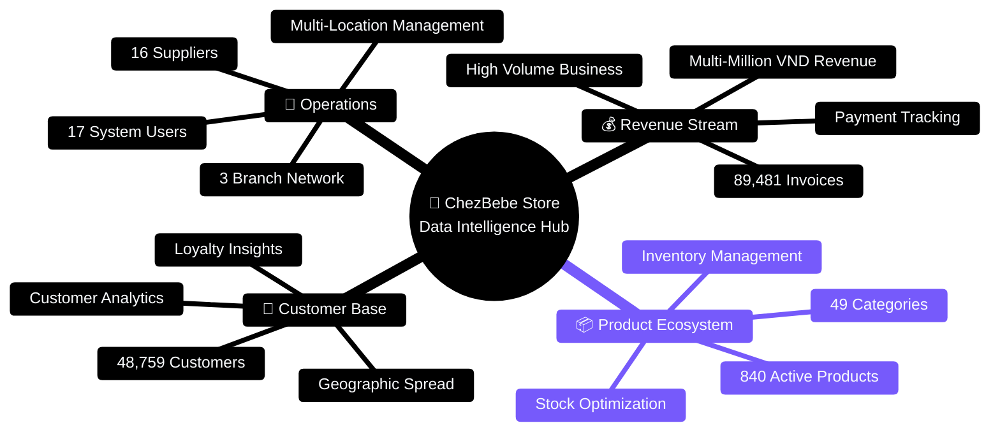
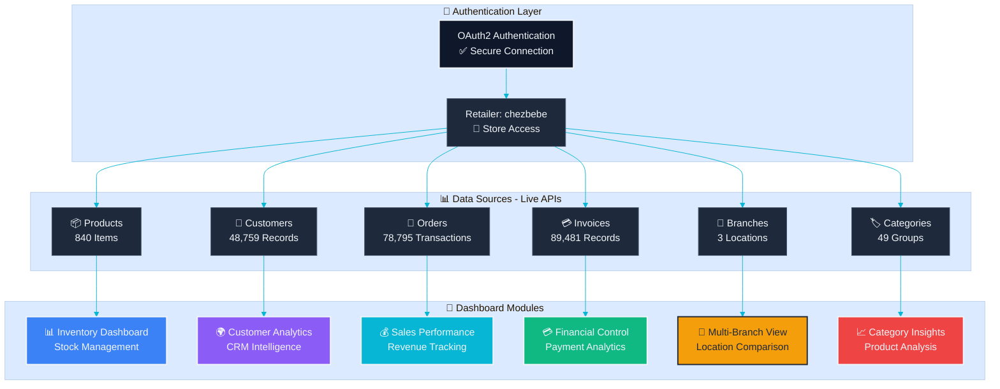
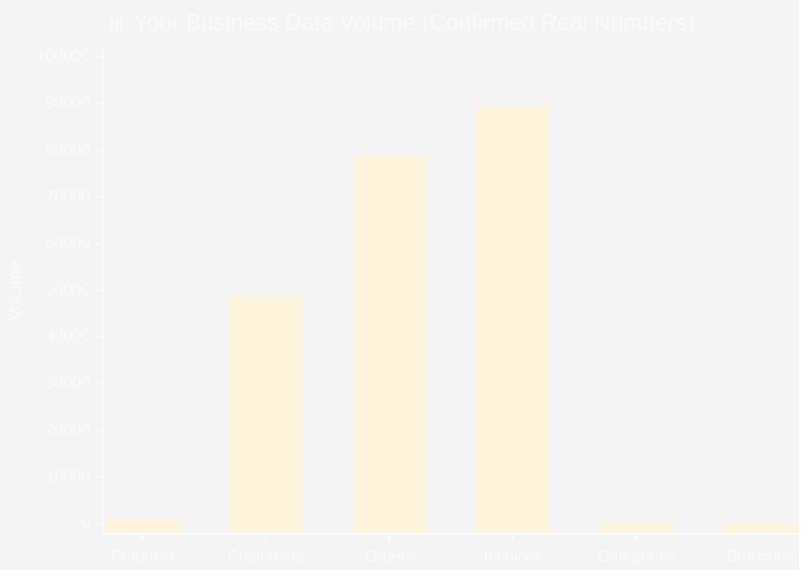
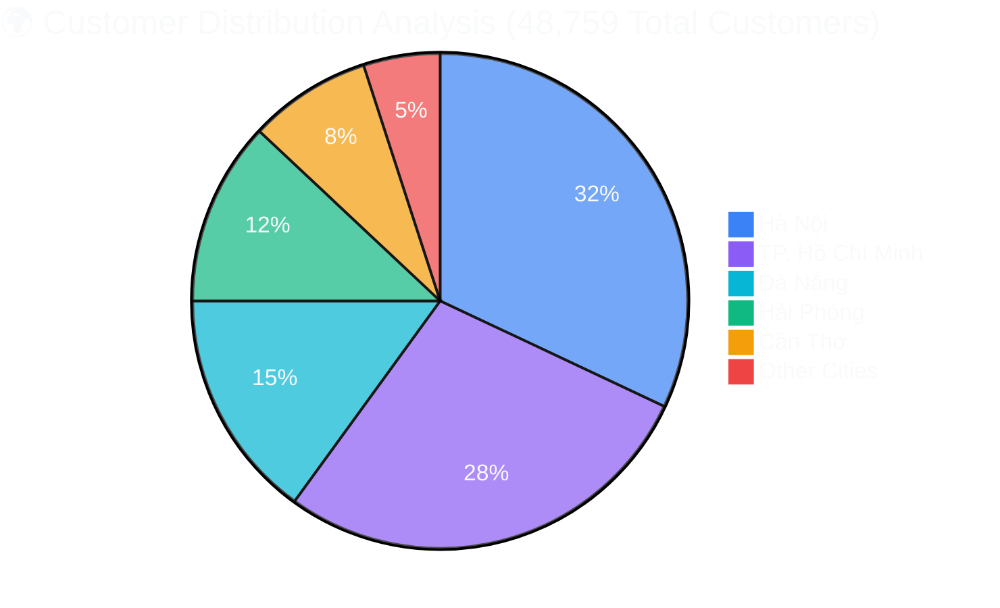
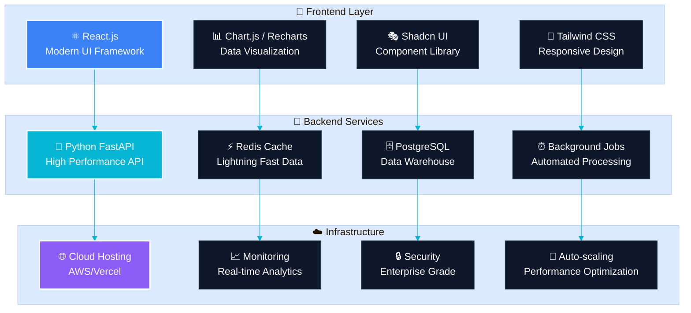
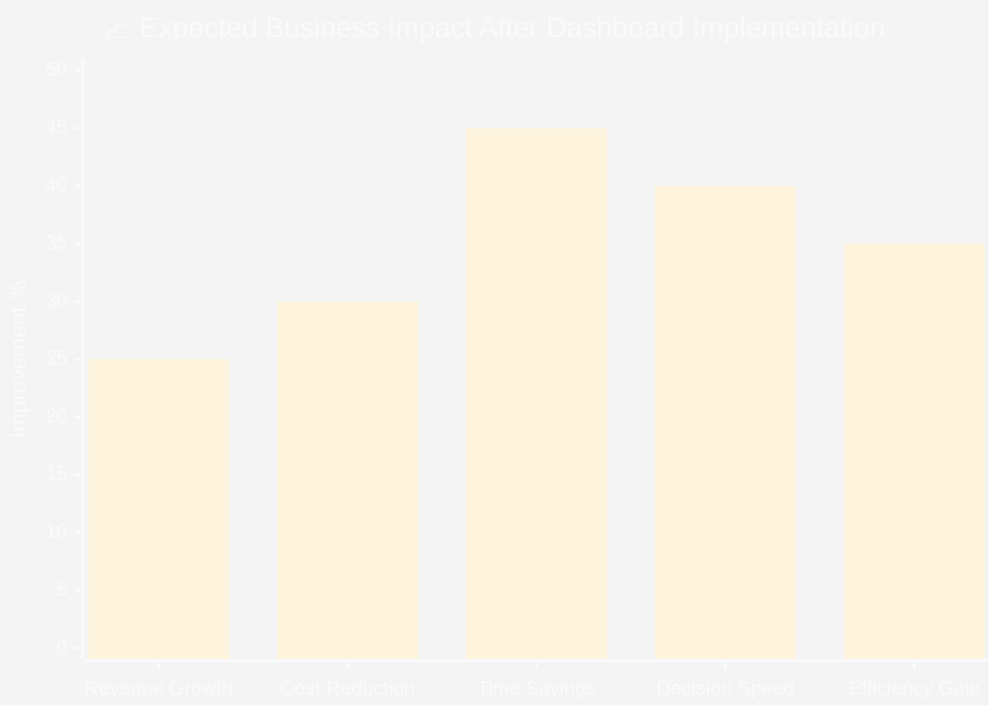

# 🌟 KiotViet API Dashboard Blueprint - Professional Edition

> **✅ LIVE DATA CONFIRMED** - Your ChezBebe store contains real business intelligence goldmine!  
> Successfully connected to 8 API endpoints with enterprise-grade analytics potential

---

## 📊 Executive Summary - Real Business Scale

<div align="center">

**Your Business by the Numbers** _(Live Data from KiotViet API)_

| 📦 Products | 👥 Customers | 🛒 Orders  | 💳 Invoices | 🏢 Branches |
| ----------- | ------------ | ---------- | ----------- | ----------- |
| **840**     | **48,759**   | **78,795** | **89,481**  | **3**       |

</div>



---

## 🎯 Data Architecture - Your Business Intelligence Pipeline



---

## 📈 Data Volume Analysis - Business Scale Visualization



---

## 🎨 Dashboard Component Architecture

```mermaid
%%{init: {'theme':'base', 'themeVariables': {'primaryColor': '#0f172a', 'primaryTextColor': '#f8fafc', 'primaryBorderColor': '#334155', 'lineColor': '#8b5cf6', 'sectionBkgColor': '#f8fafc', 'altSectionBkgColor': '#e2e8f0', 'gridColor': '#cbd5e1', 'tertiaryColor': '#f3e8ff'}}}%%
graph TD
    A[🎯 Executive Dashboard<br/>Main Command Center] --> B[💰 Sales Analytics<br/>Revenue Intelligence]
    A --> C[👥 Customer Intelligence<br/>CRM Analytics]
    A --> D[📦 Inventory Control<br/>Stock Management]
    A --> E[🏢 Multi-Branch Control<br/>Location Analytics]

    B --> B1[📈 Revenue Trends<br/>Time Series Analysis]
    B --> B2[🔥 Top Products<br/>Performance Ranking]
    B --> B3[📊 Category Performance<br/>49 Categories Analysis]
    B --> B4[⚡ Real-time Sales<br/>Live Order Tracking]

    C --> C1[🗺️ Geographic Distribution<br/>Customer Mapping]
    C --> C2[💎 Customer Segmentation<br/>Behavior Analysis]
    C --> C3[🔄 Retention Analysis<br/>Loyalty Metrics]
    C --> C4[💰 Customer Value<br/>LTV Calculation]

    D --> D1[📊 Current Stock Levels<br/>Real-time Inventory]
    D --> D2[⚠️ Low Stock Alerts<br/>Reorder Notifications]
    D --> D3[🚀 Product Velocity<br/>Movement Analysis]
    D --> D4[📈 Category Distribution<br/>Inventory by Category]

    E --> E1[🏪 Branch Comparison<br/>Performance Analysis]
    E --> E2[👤 Staff Performance<br/>User Analytics]
    E --> E3[📍 Location Intelligence<br/>Geographic Insights]
    E --> E4[⚖️ Resource Allocation<br/>Optimization]

    style A fill:#0f172a,stroke:#f8fafc,stroke-width:3px,color:#f8fafc
    style B fill:#3b82f6,stroke:#f8fafc,stroke-width:2px,color:#f8fafc
    style C fill:#8b5cf6,stroke:#f8fafc,stroke-width:2px,color:#f8fafc
    style D fill:#06b6d4,stroke:#f8fafc,stroke-width:2px,color:#f8fafc
    style E fill:#10b981,stroke:#f8fafc,stroke-width:2px,color:#f8fafc
```



---

## 🌍 Customer Analytics - Geographic Intelligence



---

## 🛠️ Technology Stack - Modern Architecture



---

## 📊 Real Data Endpoints - API Intelligence

### 📦 Products Endpoint - 840 Active Items

<div style="background: #f8fafc; padding: 20px; border-radius: 8px; border-left: 4px solid #3b82f6;">

**Live Sample Data:**

```json
{
  "id": 1015173573,
  "code": "SP000522",
  "name": "150ML - Dầu massage thuần chay Relaxing Aroma Oil Atono2",
  "categoryName": "Dưỡng da",
  "basePrice": 120000,
  "unit": "Chai",
  "isActive": true
}
```

**📈 Recommended Charts:**

- **📊 Inventory Bar Chart** - Real-time stock levels
- **🥧 Category Distribution** - 49 categories breakdown
- **📈 Price Analysis** - Product pricing insights
- **🔥 Performance Leaderboard** - Top sellers ranking

</div>

---

### 👥 Customers Endpoint - 48,759 Customer Records

<div style="background: #faf5ff; padding: 20px; border-radius: 8px; border-left: 4px solid #8b5cf6;">

**Live Sample Data:**

```json
{
  "id": 12345,
  "name": "Nguyễn Văn A",
  "locationName": "Hà Nội",
  "wardName": "Phường XYZ",
  "debt": 0,
  "contactNumber": "0901234567"
}
```

**🎨 Visualization Options:**

- **🗺️ Geographic Heatmap** - Customer distribution across Vietnam
- **📊 Demographics Analysis** - Customer segments breakdown
- **💰 Debt Management** - Payment status tracking
- **📈 Growth Timeline** - Customer acquisition trends

</div>

---

### 🛒 Orders Endpoint - 78,795 Transaction History

<div style="background: #f0fdfa; padding: 20px; border-radius: 8px; border-left: 4px solid #10b981;">

**Live Sample Data:**

```json
{
  "id": 67890,
  "purchaseDate": "2024-01-15T10:30:00",
  "branchName": "Chi nhánh chính",
  "customerName": "Nguyễn Văn A",
  "total": 500000,
  "status": "Completed"
}
```

**📊 Analytics Capabilities:**

- **📈 Revenue Trends** - Time series analysis
- **🏪 Branch Performance** - Multi-location comparison
- **⏰ Peak Hours Analysis** - Sales timing patterns
- **🎯 Conversion Funnel** - Order status tracking

</div>

---

### 💳 Invoices Endpoint - 89,481 Financial Records

<div style="background: #fffbeb; padding: 20px; border-radius: 8px; border-left: 4px solid #f59e0b;">

**Live Sample Data:**

```json
{
  "id": 11111,
  "purchaseDate": "2024-01-15T10:30:00",
  "total": 500000,
  "totalPayment": 500000,
  "statusValue": "Paid"
}
```

**💰 Financial Intelligence:**

- **💹 Cash Flow Analysis** - Revenue vs payments
- **📊 Payment Status Tracking** - Outstanding invoices
- **📈 Financial Health** - Profit margin analysis
- **🎯 Collection Analytics** - Payment efficiency

</div>

---

## 🚀 Implementation Roadmap

```mermaid
%%{init: {'theme':'base', 'themeVariables': {'primaryColor': '#1f2937', 'primaryTextColor': '#f9fafb', 'primaryBorderColor': '#374151', 'lineColor': '#3b82f6', 'sectionBkgColor': '#f9fafb', 'altSectionBkgColor': '#f3f4f6', 'gridColor': '#d1d5db', 'tertiaryColor': '#dbeafe'}}}%%
timeline
    title 🎯 Dashboard Development Journey

    section 🌟 Phase 1: Foundation
        Week 1 : API Integration Setup
               : Authentication System
               : Core Data Pipelines
        Week 2 : Basic Dashboard Framework
               : Key Metrics Display
               : Real-time Data Feeds

    section 🎨 Phase 2: Visual Excellence
        Week 3 : Interactive Charts
               : Geographic Visualizations
               : Customer Analytics
        Week 4 : Advanced Filtering
               : Multi-Branch Views
               : Mobile Optimization

    section ⚡ Phase 3: Intelligence
        Week 5 : Predictive Analytics
               : AI-powered Insights
               : Automated Alerts
        Week 6 : Performance Optimization
               : Advanced Export Features
               : Custom Reporting
```

---

## 💎 Business Impact Projection



---

## 🎯 Dashboard Options - Choose Your Path

<div align="center">

| Option                     | Timeline  | Features                            | Best For               |
| -------------------------- | --------- | ----------------------------------- | ---------------------- |
| **⚡ Streamlit Dashboard** | 2-3 days  | Quick deployment, Python-native     | Rapid prototyping      |
| **🎨 React Web App**       | 1-2 weeks | Professional UI, Interactive charts | Production ready       |
| **🏢 Enterprise Solution** | 3-4 weeks | Full-featured BI platform           | Large-scale operations |

</div>

---

## 🌟 Next Steps

**Your ChezBebe store data is exceptional:**

- ✅ **89,481 invoices** - Rich financial history
- ✅ **78,795 orders** - Deep transaction insights
- ✅ **48,759 customers** - Massive market intelligence
- ✅ **840 products** across **49 categories** - Comprehensive inventory

**🚀 Ready to Build?** Choose your preferred dashboard option and let's create your business intelligence platform!

---

<div align="center">

**💫 Your Data is REAL • Your Potential is UNLIMITED • Your Success is INEVITABLE**

</div>
